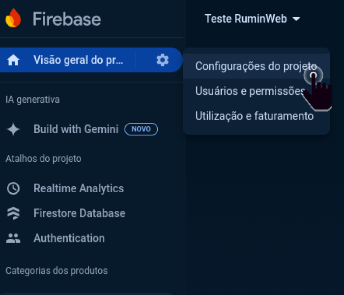
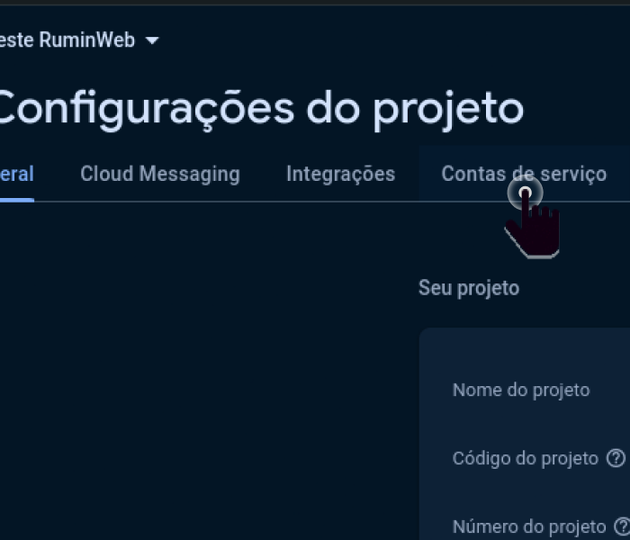
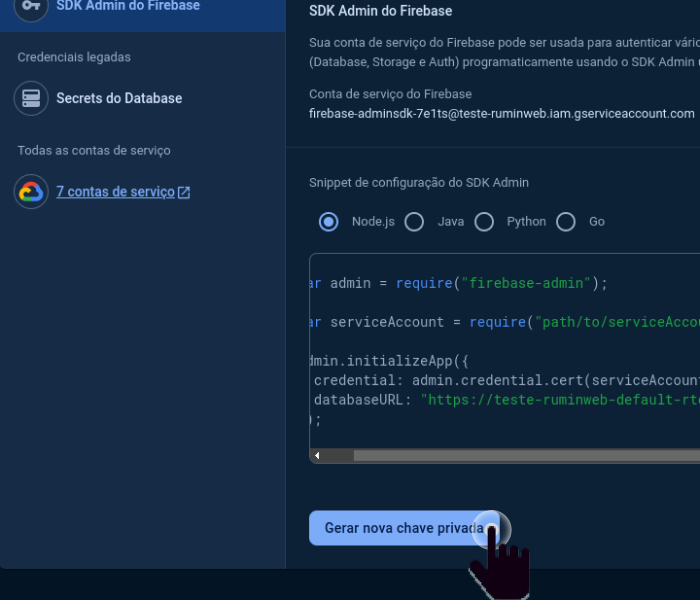

# API de Gerenciamento de Propriedades e Animais

Esta API foi desenvolvida para gerenciar informações de usuários, propriedades e animais. O backend utiliza **FastAPI** e **Firebase Firestore** para armazenar dados. A autenticação é realizada por meio do **Firebase Authentication**.

## Funcionalidades

- **Usuários**: Obtenção de informações de usuários via ID.
- **Propriedades**: Recuperação das propriedades de um usuário.
- **Animais**: Listagem de animais por propriedade e contagem por categoria, raça e sexo.

## Endpoints Principais

- `/user/{user_id}`: Retorna as informações do usuário.
- `/user/{user_id}/properties`: Retorna todas as propriedades de um usuário.
- `/user/{user_id}/property/{prop_id}/animals`: Retorna os animais de uma propriedade.
- `/animals`: Retorna todos os animais de todas as propriedades.

## Como Executar o Projeto

1. Clone o repositório:

    ```bash
    git clone https://github.com/Wesley00s/rumin-web-api-py.git
    cd rumin-web-api-py
    ```

2. Instale as dependências necessárias:

    ```bash
    pip install -r requirements.txt
    ```

3. Configure o Firebase:
   - Baixe a chave privada do Firebase seguindo as instruções na próxima seção.
   - Coloque o arquivo da chave privada em `firebase/serviceAccountKey.json`.

4. Execute a API:

    ```bash
    python3 app.py
    ```

## Como Configurar a Chave Privada do Firebase

Siga os passos abaixo para baixar a chave privada e configurar o Firebase no projeto.

1. Acesse o [Console Firebase](https://console.firebase.google.com/).
2. Selecione seu projeto.
3. No painel lateral, clique em "Configurações do projeto".
4. - 

5. Vá para a aba "Contas de serviço".
6. - 

7. Clique no botão "Gerar nova chave privada".
8. - 

9. Baixe o arquivo `.json` e salve-o na pasta `firebase` do seu projeto com o nome `serviceAccountKey.json`.

